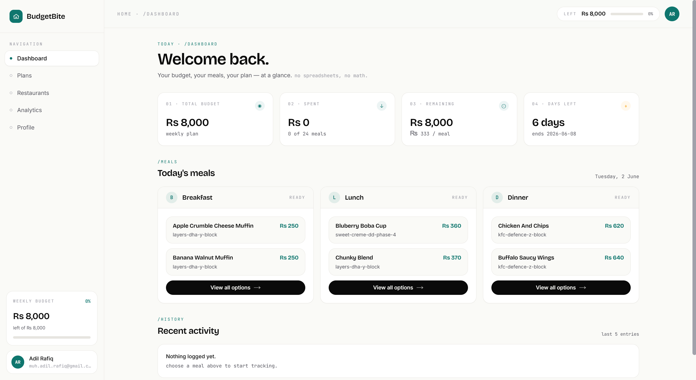
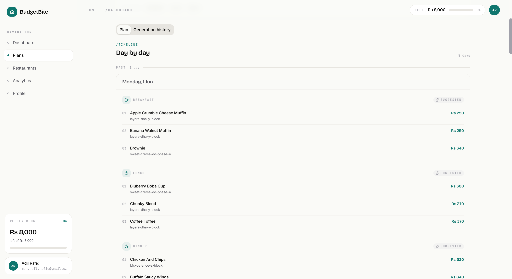
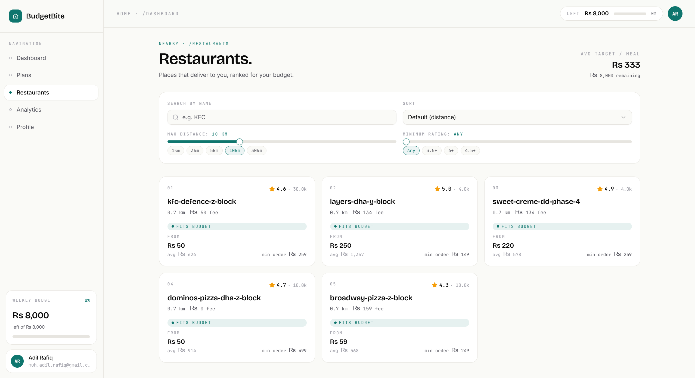
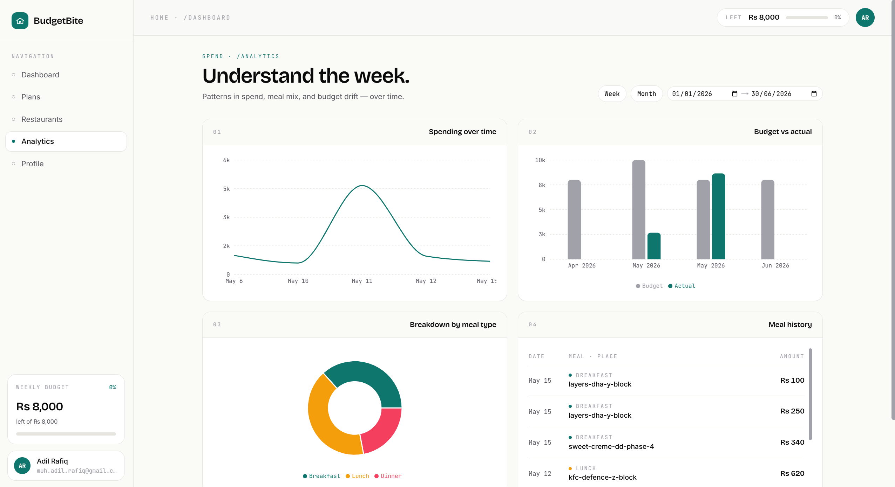

# BudgetBite

> An AI meal-planner that suggests meals from real restaurant menus near you and keeps your spending inside a chosen food budget.

BudgetBite picks meals from menus that have been scraped from local delivery apps, asks an LLM to lay out a plan within your budget, and lets you log what you actually ordered so the AI can re-plan against what's left. The app **does not** place orders — you order on the delivery app yourself and log the amount spent.

<p align="center">
  
  
</p>
<p align="center">
  
  
</p>

## What it does

- **Plan-aware AI generation.** The LLM gets the user's remaining budget, time window, meal types, and a paginated slice of nearby menu items, then returns a structured plan plus N options per meal slot.
- **Re-plan on drift.** When cumulative actual-vs-planned spend deviates past a configurable threshold, a background re-plan is kicked off so the rest of the plan reflects what's actually left.
- **Layered Express API** with strict separation: routes validate, controllers shape responses, services hold business logic, repositories are the only code that touches the database.
- **Provider-agnostic LLM layer.** One `LLMProvider` interface, three implementations (Google Gemini, Anthropic, OpenAI). Default is Gemini's free tier — no credit card required to run the project end-to-end.
- **Two-tier admin auth.** Admin endpoints accept either an `X-API-Key` (used by the scraper, service-to-service) or a logged-in user with `role === 'admin'`.
- **Onboarding as a state machine.** XState drives the multi-step onboarding wizard, plus the plan-creation wizard.
- **Shared Zod schemas.** Request/response contracts live in `@repo/shared` and are consumed by both API routes and web forms — single source of truth for validation.

## Tech stack

| Area     | Choice                                                                       |
| -------- | ---------------------------------------------------------------------------- |
| Web      | Next.js 16 (App Router), React 19, Tailwind 4, shadcn/ui, TanStack Query, ky |
| API      | Node 22, Express 5, TypeScript (ESM), Zod, better-auth                       |
| Database | Neon (serverless Postgres) + Drizzle ORM                                     |
| AI       | `LLMProvider` abstraction — Gemini / Anthropic / OpenAI, picked via env      |
| Scraper  | Python + Playwright + SeleniumBase (admin-auth, service-to-service)          |
| Auth     | better-auth on both ends (email + OTP, Google OAuth, GitHub OAuth)           |
| Tooling  | pnpm 10 + Turborepo, ESLint (`--max-warnings 0`), Prettier, XState 5         |

Full rationale: [`TECH-STACK.md`](TECH-STACK.md). Product spec: [`apps/api/REQUIREMENTS.md`](apps/api/REQUIREMENTS.md). Agent-facing notes: [`CLAUDE.md`](CLAUDE.md).

## Repo layout

```
apps/
  api/         Express API — routes → controllers → services → repositories
  web/         Next.js web app
  scraper/     Python scraper for delivery menus (educational use only — see apps/scraper/README.md)
packages/
  database/    Drizzle schema, migrations, repositories. The only module that touches the DB.
  ai/          LLM provider abstraction + prompts
  shared/      Zod schemas + inferred TS types shared by API and web
  eslint-config/, typescript-config/
```

## Prerequisites

- Node.js 22 LTS (the root `engines.node` is `>=18`, but the API targets 22)
- pnpm 10.30+ (declared via `packageManager`)
- Python 3 (only if you intend to run the scraper)
- A Neon Postgres database (free tier is enough)
- An AI provider API key — Gemini's free tier works without a credit card

## Quick start

```bash
pnpm install

# 1) Copy env templates and fill in the blanks
cp .env.example .env
# also: apps/api/.env, apps/web/.env.local, packages/database/.env

# 2) Generate the better-auth schema + run migrations against your DB
pnpm db:migrate

# 3) Run web (:3000) and API (:3001) together
pnpm dev
```

Open <http://localhost:3000> and sign up. The web app will redirect through onboarding to capture residence latitude/longitude and budget preferences. To populate restaurants/menus you can either insert rows manually or use `apps/scraper` (read its [README](apps/scraper/README.md) first).

## Common commands

```bash
pnpm dev                              # turbo run dev across all apps
pnpm build                            # turbo run build
pnpm lint                             # eslint --max-warnings 0 in each package
pnpm check-types                      # tsc --noEmit across the graph
pnpm format                           # prettier --write **/*.{ts,tsx,md}

pnpm db:generate                      # regen better-auth schema + create a Drizzle migration
pnpm db:migrate                       # generate + apply

pnpm --filter web dev                 # Next.js only
pnpm --filter api dev                 # tsx watch src/index.ts
pnpm --filter @repo/database db:studio
```

There is no test runner configured yet.

## Architecture notes (the not-obvious bits)

- **Auth is better-auth on both sides.** The API mounts `app.all('/api/auth/{*any}', toNodeHandler(auth))`; the web client lives at `apps/web/lib/auth-client.ts`. Session is a cookie (`better-auth.session_token`); `apps/web/proxy.ts` (Next 16 middleware) gates routes by checking it. The user schema in `packages/database/src/schema/auth.ts` is **generated** — edit `apps/api/src/lib/auth.ts` and run `pnpm db:generate` rather than touching the schema by hand.
- **Two-tier admin auth.** Admin routes (`/api/admin/*`) accept either an `X-API-Key: $ADMIN_API_KEY` header (used by the scraper) or a logged-in user whose better-auth `role === 'admin'`. See `apps/api/src/middleware/admin.middleware.ts`.
- **Strict layering in the API.** Routes validate with Zod and dispatch; controllers only touch `req`/`res`; services hold business logic and throw `AppError`; repositories (in `packages/database`) are the only code that imports the Drizzle schema. AI code does not use `try/catch` — let `AppError`s bubble to `errorMiddleware`.
- **Numeric columns round-trip as strings.** Drizzle returns `numeric`/`decimal` as strings; services convert at the boundary (`Number(...)` on read, `String(...)` on write). See `restaurant.service.ts`.
- **AI provider abstraction.** Depend on the `LLMProvider` interface from `@repo/shared`, not a specific SDK. `createLLMProvider()` in `packages/ai/src/providers/index.ts` reads `AI_PROVIDER` (`anthropic` | `openai` | `google`) and `AI_MODEL_NAME` / `AI_API_KEY`. The `.env.example` template sets `google` + `gemini-2.5-flash`; if `AI_PROVIDER` is unset the factory falls back to `anthropic`.
- **Shared validation.** Zod schemas live in `packages/shared/src/schemas/` and are consumed by both API routes and web forms. Add the schema there first, then import from `@repo/shared` in both apps.
- **Onboarding state machine.** The web onboarding flow is an XState machine (`apps/web/app/onboarding/_hooks/use-onboarding.ts`). New steps go in `apps/web/app/onboarding/_components/steps/` and must be wired into the machine — rendering conditionally is not enough.
- **Web → API.** The web app uses `ky` against `NEXT_PUBLIC_API_URL` (default `http://localhost:3001`) and sends credentials so the better-auth cookie reaches the API. There is no Next.js API route layer in front of Express — don't add one.

## Environment

`.env.example` at the repo root is the canonical list. Each app/package has its own `.env` / `.env.local`. When you add an env var that affects build output, also add it to `turbo.json#globalEnv` so caching invalidates correctly.

Key vars:

| Var                                                                                  | Purpose                                                        |
| ------------------------------------------------------------------------------------ | -------------------------------------------------------------- |
| `DATABASE_URL`, `DIRECT_DATABASE_URL`                                                | Neon connection strings (pooled + direct for migrations)       |
| `BETTER_AUTH_SECRET`, `BETTER_AUTH_URL`                                              | better-auth session signing + base URL                         |
| `GOOGLE_CLIENT_*`, `GITHUB_CLIENT_*`                                                 | OAuth providers                                                |
| `RESEND_API_KEY`, `EMAIL_FROM`                                                       | Transactional email (password reset, verification)             |
| `ADMIN_API_KEY`                                                                      | Shared secret the scraper uses to call admin endpoints         |
| `AI_PROVIDER`, `AI_MODEL_NAME`, `AI_API_KEY`                                         | LLM selection                                                  |
| `AI_GENERATION_TEMPERATURE`, `AI_GENERATION_MAX_TOKENS`, `AI_GENERATION_MAX_RETRIES` | LLM generation tuning                                          |
| `NEARBY_RADIUS_KM`                                                                   | Default proximity radius for restaurant filtering              |
| `MAX_RESTAURANTS`, `MAX_ITEMS_PER_RESTAURANT`                                        | Caps passed into the AI context                                |
| `REPLAN_CUMULATIVE_DEVIATION_RATIO_THRESHOLD`                                        | When actual spend drifts this far from plan, trigger a re-plan |
| `AUTO_GENERATE_ON_CREATE`                                                            | Generate an initial AI plan on budget-plan creation            |
| `NEXT_PUBLIC_API_URL`, `NEXT_PUBLIC_WEB_URL`                                         | Public origins for the web app                                 |

## Conventions

- ESM everywhere. In `apps/api` and `packages/database`/`packages/ai`, relative imports must end in `.js` even though the source is `.ts`.
- `eslint --max-warnings 0` — warnings fail CI/turbo.
- Do not edit auto-generated files: `packages/database/src/schema/auth.ts` (better-auth) and `packages/database/drizzle/*.sql` / `meta/*.json` (drizzle-kit).
- The Express API is the only HTTP backend; don't add Next.js API routes.
- Prefer extending an existing service over adding a new one for a closely related operation. Admin and user-facing operations on the same resource share a service (e.g. `restaurant.service.ts` has both `list` and `createRestaurant`).

## License

[Elastic License 2.0](LICENSE)

This project is source-available under the Elastic License 2.0. You are free
to read, run, and modify it, but you may not offer it as a hosted or managed
service. See the [LICENSE](LICENSE) file for full terms.

The scraper has additional usage notes in [`apps/scraper/README.md`](apps/scraper/README.md);
please read them before running it.
